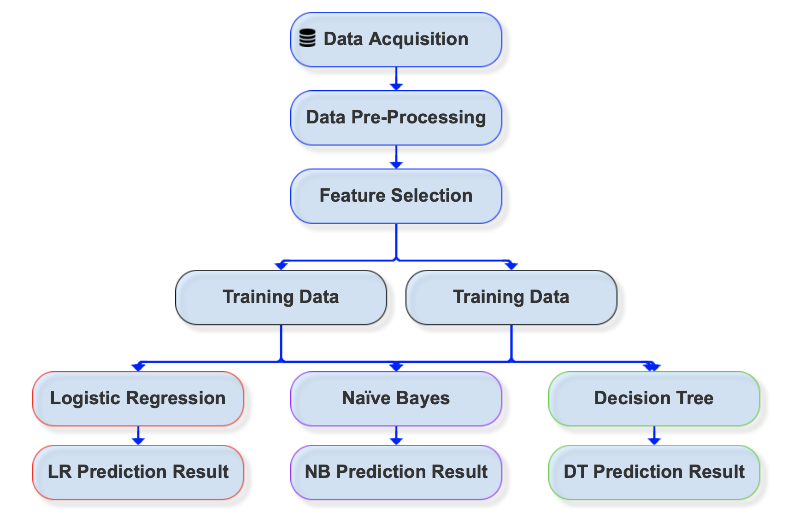

# CS 613: Machine Learning

## _Final Project_: Heart Disease Predictions Using Machine Learning

> #### Our Team:
> - Harsh Bolakani hvb36@drexel.edu
> - Greg Morgan gm655@drexel.edu
> - Trevor Pawlewicz tmp365@drexel.edu

---

### Mission Statement

Our goal for the project is to approach Heart Disease and compare different classification algorithms on a Heart Failure Prediction Dataset to predict and compare which one does well. We will also compare our algorithms with a neural network to see if does any better.
Our predictions will have a substantial impact on detecting early identification of heart disease. This important because it can provide treatment, increase life expectancy, prevent disability and costly hospitalizations while improving the quality of life.
Loss of heart function is irreversible. Once the damage has been done, a person cannot return to having a fully functional heart. Early detection is key.

### Research Aim

Cardiovascular diseases (CVDs) are the number 1 cause of death globally, taking an estimated 17.9 million lives each year, which accounts for 31% of all deaths worldwide. Four out of 5 CVD deaths are due to heart attacks or strokes, and one-third of these deaths occur prematurely in people under 70 years of age. Heart failure is a common event caused by CVDs and this dataset contains 11 features that can be used to predict heart disease.
People with cardiovascular disease or who are at high cardiovascular risk (due to the presence of one or more risk factors such as hypertension, diabetes, hyperlipidemia or already established disease) need early detection and management wherein a machine learning model can be of great help.

### Basic Approach

The manufacturing process models are done with the following steps: data collecting, pre-processing, model building, comparison of models, and evaluation.

- Exploratory Data Analysis
- Data Processing
- Applying algorithms to train a model:
  - Logistic Regression
  - Naive Bayes
  - Decision Tree/Random Forest
- Prediction Results Comparison

_Additional analysis:
Neural Network comparison_

### Run the Jupyter notebook on your local computer:
notebook/`CS613_project_heart_disease_prediction.ipynb`

---

